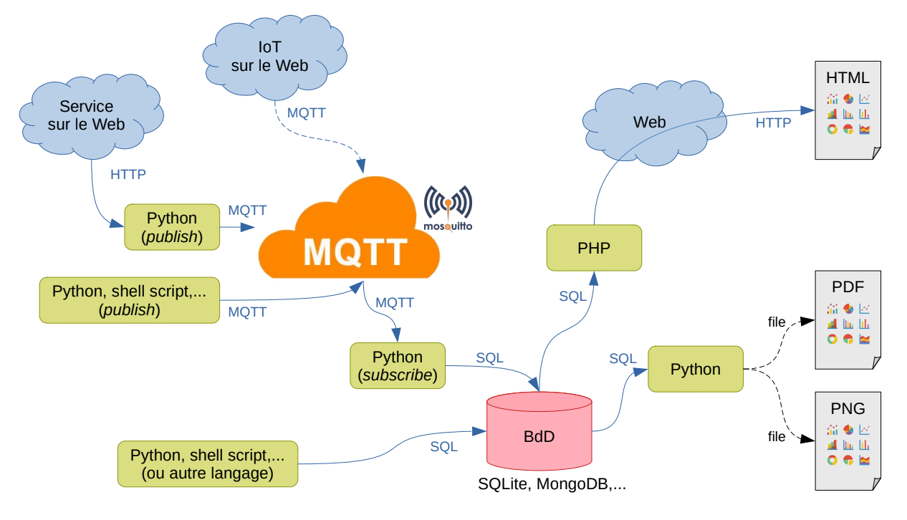

# SAE .203 MQTT

## Résumé du Projet

Ce projet consiste à concevoir une plateforme de gestion d'informations en IoT (Internet of Things, ou objets connectés) utilisant le protocole **MQTT** (Message Queuing Telemetry Transport). Pour enrichir notre projet, nous allons utiliser une **API météo** pour collecter des données supplémentaires en temps réel. De plus, l'exécution des scripts PHP se fera sur le serveur de l'IUT, qui servira de plateforme d'hébergement pour la partie web.

### Description de l'architecture

L'architecture de la solution repose sur plusieurs composants :

1. **Devices IoT** qui envoient des données via le protocole MQTT.
2. **Programmes intermédiaires** (ex: Python) qui publient des données sur MQTT à partir de différents dispositifs (publishers).
3. **Programmes abonnés** (ex: Python) qui récupèrent ces données via MQTT (subscribers) et les stockent dans une base de données (ex: SQL ou SQLite).
4. **Programmes de visualisation** qui permettent d'afficher les données stockées via différents formats, comme des pages HTML générées par des scripts PHP, des documents PDF ou des images PNG.

La plateforme permet une gestion flexible des informations provenant des dispositifs IoT, avec un stockage centralisé et une présentation des données via différentes interfaces.

### Schéma d'Installation

Voici un schéma illustrant l'architecture générale et l'installation de la plateforme (incluant la connexion à l'API météo et le serveur de l'IUT).

## Fichiers du Projet

- **[graph_commente.php](chemin/vers/graph_commente.php)** : Ce fichier PHP génère des graphes basés sur les données récupérées depuis la base de données.
- **[publish.py](chemin/vers/publish.py)** : Ce script Python permet de publier des données sur le serveur MQTT.
- **[sub_test.py](chemin/vers/sub_test.py)** : Ce script Python souscrit aux messages envoyés via MQTT et les stocke dans une base de données.
- **[database.sql](chemin/vers/database.sql)** : Script SQL pour la création de la base de données principale.
- **[database.sqlite](chemin/vers/database.sqlite)** : Fichier de base de données SQLite pour le stockage local des données.

## Instructions d'Installation

1. Installez les dépendances nécessaires pour exécuter les scripts Python et PHP.
2. Configurez un serveur MQTT et assurez-vous que les devices IoT peuvent se connecter à celui-ci.
3. Lancez le programme `publish.py` pour publier des données depuis les dispositifs IoT.
4. Exécutez `sub_test.py` pour récupérer ces données via MQTT et les stocker dans la base de données.
5. Utilisez `graph_commente.php` pour visualiser les données stockées sous forme de graphiques ou autres.

## Technologies Utilisées

- **MQTT** : Pour la communication entre les devices IoT et la plateforme.
- **Python** : Pour le traitement et le transfert des données.
- **PHP** : Pour la génération de pages web dynamiques sur le serveur de l'IUT.
- **SQL/SQLite** : Pour le stockage des données dans une base de données.
- **API Météo** : Pour récupérer des données météorologiques en temps réel.

## Licence

Ce projet est sous licence [Nom de la licence].

